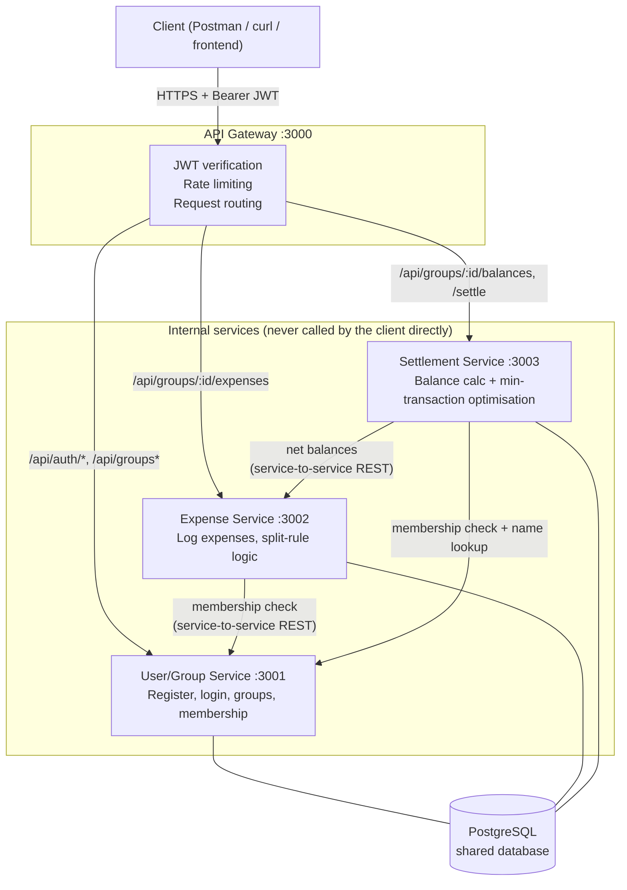
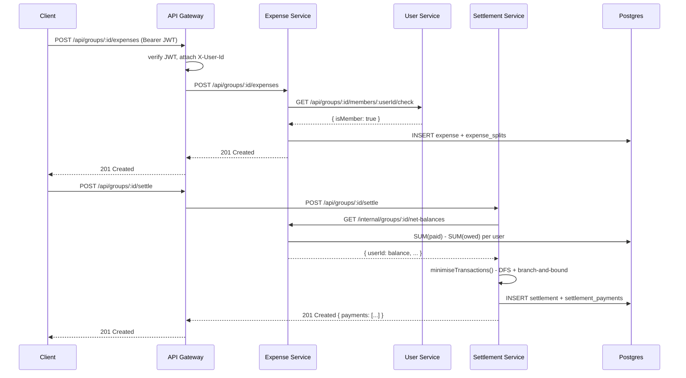

## NADV 744 Assignment

SmartSplit is a service-driven expense management system developed for
the NADV 744 Advanced Development Systems group assignment.

The system demonstrates:

- REST-based service-oriented architecture
- API Gateway
- JWT authentication
- PostgreSQL persistence
- React frontend
- Equal, exact and percentage expense splitting
- Settlement optimisation
- Automated unit and integration testing
- Performance and scalability testing
- Error handling and transaction management
- Git/GitHub version control


# SmartSplit

A distributed, service-oriented group expense-splitting system, built for the NADV 744
(Advanced Development Systems) group assignment at Sol Plaatje University.

SmartSplit lets a group of people log shared expenses (accommodation, food, transport, etc.),
see who owes what, and settle up using the **minimum possible number of payments** — solved
with an exact DFS + branch-and-bound optimisation algorithm rather than a naive greedy guess.

---

## 1. Architecture

Four independently-runnable Node.js/Express microservices sit behind a single API Gateway,
sharing one PostgreSQL database (each service only touches the tables it owns).



**Why this shape:**
- The **gateway** is the single point of entry: it verifies the JWT once and forwards the
  authenticated user id downstream via an `X-User-Id` header, so internal services never
  re-parse tokens and are never reachable directly by an external client in production.
- Each service owns its own routes and can be started, tested, and scaled independently.
- Services talk to each other over plain REST (`axios`) rather than sharing code, which is
  what keeps this a genuine service-oriented design rather than a modular monolith.
- All four services share one Postgres database for simplicity (documented as a limitation /
  future improvement below — a "database per service" split is the natural next step).

### Data flow for the core use case (log an expense → settle up)



### API endpoints

| Method | Path | Service | Auth | Purpose |
|---|---|---|---|---|
| POST | `/api/auth/register` | user-service | public | Create an account |
| POST | `/api/auth/login` | user-service | public | Get a JWT |
| POST | `/api/groups` | user-service | required | Create a group (creator auto-joins) |
| GET | `/api/groups` | user-service | required | List my groups |
| GET | `/api/groups/:id/members` | user-service | required | List a group's members |
| POST | `/api/groups/:id/members` | user-service | required | Add a registered user by email |
| POST | `/api/groups/:id/expenses` | expense-service | required | Log a shared expense |
| GET | `/api/groups/:id/expenses` | expense-service | required | List a group's expenses |
| PUT | `/api/groups/:id/expenses/:expenseId` | expense-service | required | Edit an expense and replace its split |
| DELETE | `/api/groups/:id/expenses/:expenseId` | expense-service | required | Delete an expense |
| GET | `/api/groups/:id/balances` | settlement-service | required | Current net balance per member |
| POST | `/api/groups/:id/settle` | settlement-service | required | Compute + persist the optimal payment plan |
| GET | `/api/groups/:id/settlements` | settlement-service | required | Settlement history |
| GET | `/api/groups/:id/settlements/:sid` | settlement-service | required | One past settlement |
| GET | `/health` | every service | public | Liveness check |

All protected routes expect `Authorization: Bearer <token>` from `/api/auth/login` or `/api/auth/register`.

---

## 2. Prerequisites

- **Node.js** ≥ 18 and npm
- **PostgreSQL** ≥ 14, OR **Docker** (to run Postgres via the included `docker-compose.yml`)

---

## 3. Setup (run once)

```bash
# 1. Clone and enter the repo
git clone <your-github-repo-url>
cd smartsplit

# 2. Copy environment config
cp .env.example .env
# (defaults work out of the box for local development - only edit JWT_SECRET
#  and DATABASE_URL if your setup differs)

# 3. Start Postgres
#    Option A - Docker (recommended):
docker compose up -d postgres

#    Option B - your own local Postgres install: create a database + user
#    matching DATABASE_URL in .env, e.g.:
#    createuser smartsplit --pwprompt
#    createdb smartsplit -O smartsplit

# 4. Install dependencies for every service
npm run install:all

# 5. Apply the database schema
npm run migrate
```

## 4. Running the system

```bash
# Starts all 4 services together, each in its own colour-coded log stream
npm start

# or, for auto-restart on file changes during development:
npm run dev
```

You should see all four services report "listening on port ...". Verify with:

```bash
curl http://localhost:3000/health   # api-gateway
curl http://localhost:3001/health   # user-service
curl http://localhost:3002/health   # expense-service
curl http://localhost:3003/health   # settlement-service
```

Everything goes through the gateway on **port 3000** — that's the only port a client needs.

### Quick manual walkthrough

```bash
# Register two users
curl -s -X POST localhost:3000/api/auth/register -H "Content-Type: application/json" \
  -d '{"email":"alice@spu.ac.za","password":"password123","fullName":"Alice"}'
curl -s -X POST localhost:3000/api/auth/register -H "Content-Type: application/json" \
  -d '{"email":"bob@spu.ac.za","password":"password123","fullName":"Bob"}'
# (copy each "token" and "id" from the responses)

# Create a group (as Alice) and add Bob
curl -s -X POST localhost:3000/api/groups -H "Authorization: Bearer <ALICE_TOKEN>" \
  -H "Content-Type: application/json" -d '{"name":"Kimberley Trip"}'
curl -s -X POST localhost:3000/api/groups/<GROUP_ID>/members -H "Authorization: Bearer <ALICE_TOKEN>" \
  -H "Content-Type: application/json" -d '{"email":"bob@spu.ac.za"}'

# Alice logs a R300 expense split equally
curl -s -X POST localhost:3000/api/groups/<GROUP_ID>/expenses -H "Authorization: Bearer <ALICE_TOKEN>" \
  -H "Content-Type: application/json" \
  -d '{"description":"Accommodation","amount":300,"splitType":"equal","memberIds":["<ALICE_ID>","<BOB_ID>"]}'

# Check balances, then settle
curl -s localhost:3000/api/groups/<GROUP_ID>/balances -H "Authorization: Bearer <ALICE_TOKEN>"
curl -s -X POST localhost:3000/api/groups/<GROUP_ID>/settle -H "Authorization: Bearer <ALICE_TOKEN>"
```

---

## 5. Testing

Each service has its own Jest test suite: fast, dependency-free **unit tests** for pure logic
(the optimisation algorithm, the split-rule calculator), plus **integration tests** (via
`supertest`) that exercise the real Express app against the real Postgres database and,
where relevant, the real running upstream services.

```bash
# Run everything (services must be running for the cross-service integration tests -
# npm start in another terminal first)
npm test

# Or test one service in isolation
cd services/settlement-service && npm test
```

**Current coverage: 55 tests, all passing** across:
- `settlement-service`: 6 algorithm unit tests + 4 integration tests (10 total)
- `expense-service`: 17 split-logic unit tests (`src/lib/splitLogic.js`, framework-free) + 7 integration tests (24 total)
- `user-service`: 14 integration tests (register/login/groups/membership + auth failure paths)
- `api-gateway`: 7 integration tests (routing, auth enforcement, 404 handling)

Split-calculation and split-validation logic lives in its own dependency-free module
(`services/expense-service/src/lib/splitLogic.js`), separate from the Express route layer
(`routes/expenses.js`), so it can be unit-tested without a server or database and reused
without duplicating business logic.

### Performance & scalability

`scripts/perf-test.js` drives the real HTTP API to simulate a large group and times each stage:

```bash
node scripts/perf-test.js 50 500   # 50 members, 500 random expenses
```

Measured results on a modest dev machine:

| Members | Expenses | Register | Log expenses | Fetch balances | Run settlement | Algorithm used |
|---|---|---|---|---|---|---|
| 10 | 60 | 0.94s | 0.45s | 12ms | 28ms | exact (DFS + branch-and-bound) |
| 50 | 500 | 4.8s | 5.0s | 36ms | 59ms | exact per-cluster, greedy fallback above 12 members |

The optimisation engine automatically switches from the exact algorithm to a fast greedy
fallback once a single tangled group of debts exceeds 12 members (configurable via
`EXHAUSTIVE_SEARCH_LIMIT` in `minTransactions.js`), since exact search is exponential -
this keeps worst-case response times bounded as groups scale, at a small cost to how
"minimal" the fallback's payment count is. This trade-off is a deliberate, documented
design decision, not an oversight.

---

## 6. Error handling

- Every service has a central Express error-handling middleware (`middleware/errorHandler.js`)
  that maps Postgres constraint violations (unique, foreign key, check) to appropriate 4xx
  responses instead of leaking raw database errors.
- Input validation happens at the route layer before any database write (missing fields,
  invalid email format, short passwords, malformed split amounts, unknown split types).
- The API Gateway returns `502 Bad Gateway` if a downstream service is unreachable, rather
  than hanging or crashing.
- The optimisation engine defensively verifies that balances net to zero before running,
  guarding against a bug anywhere upstream silently producing an unsettleable ledger.
- All database writes that touch multiple tables (creating a group + adding the creator,
  logging an expense + its splits, persisting a settlement + its payments) run inside a
  Postgres transaction with `ROLLBACK` on failure, so partial writes can't corrupt the data.

---

## 7. Known limitations & future improvements

*(honest list, as the rubric explicitly rewards this in the report)*

- **Shared database**: all services currently share one Postgres instance. A stricter
  microservices design would give each service its own database and communicate purely
  over REST/events - this was a deliberate scope trade-off for the assignment timeline.
- **Exact settlement algorithm is exponential**: capped at 12 members per tangled cluster
  before falling back to a greedy heuristic (see Performance section above). A polynomial
  approximation algorithm for large single clusters is a natural next step.
- **No refresh tokens**: JWTs expire (`JWT_EXPIRES_IN`, default 2h) and there's no refresh
  flow yet - users simply log in again.
- **No group deletion yet**: expense CRUD is implemented because it is part of the service rubric, while group deletion is intentionally outside the demo scope.
- **Settlement history is snapshot-based**: editing/deleting an expense changes the current balances but does not rewrite an old settlement record. A new settlement should be generated after a ledger change.
- **Gateway rate limiting is a single global bucket** per IP rather than per-user or per-route; the demo default is 1,000 requests/minute so the scalability test can exercise the gateway without being throttled. Production deployments should tune this lower and use per-route/per-user policies.
- **Service-to-service calls use short timeouts and retries** and surface a `503 Service Unavailable` when a dependency cannot be reached, rather than returning an opaque `500`.

---

## 8. Project structure

```
smartsplit/
├── docker-compose.yml        # Postgres for local dev
├── db/init.sql                # Full schema (idempotent)
├── .env.example
├── package.json                # Root orchestration (install/start/test all services)
├── scripts/perf-test.js       # Performance & scalability test
├── services/
│   ├── api-gateway/            # JWT auth, routing, rate limiting
│   ├── user-service/           # Auth, groups, membership
│   ├── expense-service/        # Expenses, split-rule logic
│   └── settlement-service/     # Balances, min-transaction optimisation
└── docs/                       # Report source material (see docs/)
```

## 6. Web Frontend (added for the demo)

SmartSplit now includes a responsive React/Vite frontend under `frontend/`. It is a client of
**only the API Gateway on port 3000**; the browser never calls the internal services directly.

```bash
# once
npm run frontend:install

# run the backend (Terminal 1)
npm start

# run the frontend (Terminal 2)
npm run frontend:dev
```

Open the Vite URL shown in the terminal (normally `http://localhost:5173`). The frontend supports:

- JWT registration and login
- group creation and group switching
- member management by registered email
- equal, exact and percentage expense entry
- expense search/history
- live member balances
- settlement optimisation and persisted settlement history
- responsive dashboard suitable for the assignment demonstration

The frontend is intentionally thin: business rules remain in the existing services and all browser
requests go through the gateway, preserving the service-oriented architecture described above.
